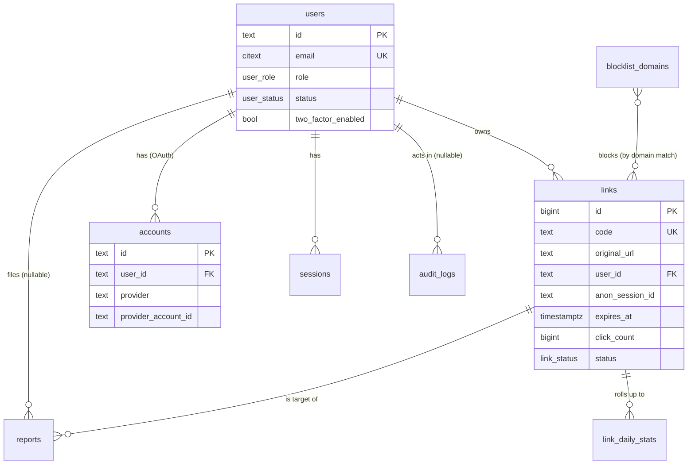

# Database Model

PostgreSQL schema for the URL shortener, derived from [`features.md`](features.md).
Target stack: **PostgreSQL + Prisma + Auth.js** (see [README](../README.md#tech-stack-plan)).
Redis holds ephemeral state only (rate-limit counters, cache) — never the source of truth.

This doc is the data contract. It is intentionally a bit wider than the MVP so that
in-scope-later and out-of-scope features have an obvious home and require **additive
migrations, not rewrites**. Sections marked _Extension_ are not built for MVP.

## Conventions

- **Timestamps:** every table has `created_at timestamptz NOT NULL DEFAULT now()`; mutable
  tables also carry `updated_at timestamptz NOT NULL DEFAULT now()` (touched on write).
- **Primary keys:** `links.id` is a **`bigint` identity** — this is a hard requirement, the
  short code is `base62(id)` (FA001.2), so the id must be monotonic and integer. All other
  tables use **`text` cuid/uuid** ids (Auth.js convention; avoids enumeration of users).
- **Enums:** modeled as native Postgres `enum` types (Prisma `enum`). Adding a value is an
  additive migration. Free-form, fast-moving sets (e.g. permissions) stay app-side.
- **Soft state vs delete:** lifecycle is expressed through `status` + `expires_at`, not row
  deletion. Audit logs and links are effectively append/replace, never hard-deleted in normal flow.
- **JSONB** (`metadata`) is used only for open-ended audit context, never for queryable domain data.
- **Money/PII:** only `email` and OAuth identifiers are stored; no destination-URL content is mined.

## Entity overview

`accounts` / `sessions` / `verification_tokens` are the Auth.js adapter tables; everything else
is application-owned.

---

## Identity & auth

### `users`

Application user + role/permission anchor. Provider identity lives in `accounts`, **not** here —
that is the deliberate change from the previous `google_sub` column and is what lets a second
provider be added later without a schema change (FA003).

| Column | Type | Notes |
|--------|------|-------|
| `id` | `text` PK | cuid (Auth.js) |
| `email` | `citext` | unique, case-insensitive |
| `email_verified` | `timestamptz?` | Auth.js field |
| `display_name` | `text?` | from OAuth profile |
| `image_url` | `text?` | avatar |
| `role` | `user_role` | `user \| admin \| super_admin`, default `user` (FC002.1) |
| `status` | `user_status` | `active \| suspended`, default `active` (FC006.2) |
| `two_factor_enabled` | `boolean` | default `false` (FC002.3) |
| `two_factor_secret` | `text?` | **encrypted at rest**; TOTP seed, null until enrolled |
| `created_at` / `updated_at` | `timestamptz` | |

Indexes: unique(`email`), index(`role`) for admin filtering.

> **2FA backup codes (FC002.3):** stored hashed in `two_factor_backup_codes(user_id, code_hash,
> used_at)` rather than an array column, so single-use consumption is atomic. Added with the 2FA work.

### `accounts` _(Auth.js adapter)_

One row per linked OAuth identity. `(provider, provider_account_id)` replaces the old `google_sub`.
FA003 upsert becomes: find `accounts(provider='google', provider_account_id=sub)` → user, else create.

| Column | Type | Notes |
|--------|------|-------|
| `id` | `text` PK | |
| `user_id` | `text` FK→users | cascade delete |
| `provider` | `text` | e.g. `google` |
| `provider_account_id` | `text` | the OAuth subject (`sub`) |
| `type`, `access_token`, `refresh_token`, `expires_at`, `id_token`, `scope`, `token_type`, `session_state` | per Auth.js | |

Unique: (`provider`, `provider_account_id`).

### `sessions` / `verification_tokens` _(Auth.js adapter)_

Standard Auth.js tables (`session_token`, `user_id`, `expires`). Admin sessions enforce a
**shorter `expires`** than regular users (FC002.3) — a value applied by the app at session
creation, not a separate table.

---

## Core link domain

### `links`

Source of truth for the short code and every redirect.

| Column | Type | Notes |
|--------|------|-------|
| `id` | `bigint` PK identity | base62 source (FA001.2) — must stay monotonic |
| `code` | `text` | `base62(id)`, unique; stored on insert (see below) |
| `original_url` | `text` | validated `http(s)`, non-self-referential (FA001.1) |
| `domain` | `citext` | host extracted from `original_url`, for blocklist joins (FC005) |
| `user_id` | `text? ` FK→users | null = anonymous link |
| `anon_session_id` | `text?` | signed session id, for claim-on-sign-in (FA003.2) |
| `expires_at` | `timestamptz?` | null = permanent; default rules in FA005 |
| `click_count` | `bigint` | default 0, incremented on redirect (FA002.1) |
| `status` | `link_status` | `active \| disabled`, default `active` (FC003.2) |
| `disabled_reason` | `text?` | set when disabled |
| `disabled_by` | `text? ` FK→users | admin actor (FC003.2) |
| `disabled_at` | `timestamptz?` | |
| `created_at` / `updated_at` | `timestamptz` | |

**Code storage:** insert row → `UPDATE code = base62(id)` in the same transaction. `code` is
stored (not computed on read) so the unique index can enforce it and redirects need a single
indexed lookup. `technical.md` lists "compute on read" as an alternative; storing is preferred.

**Resolved state** is derived, never a column: `expired = expires_at < now()`. A redirect is
`active` only when `status='active' AND (expires_at IS NULL OR expires_at > now())` AND the
`domain` is not blocklisted (FA002 / FC003 / FC005).

Indexes:
- unique(`code`) — redirect hot path.
- index(`user_id`, `created_at desc`) — history (FA004).
- index(`anon_session_id`) where not null — claim (FA003.2).
- index(`expires_at`) where not null — TTL sweeps (FA005).
- index(`domain`) — retroactive blocklist enforcement (FC005.2).
- index(`status`) / search support for admin (FC003.1; pair with `pg_trgm` on `original_url`/`code` for fuzzy search).

> **Enumeration note:** sequential `base62(id)` codes are guessable. If that becomes a concern,
> obfuscate the id→code mapping (offset + Feistel/Hashids) **without** a schema change — `code`
> stays the stored canonical value.

---

## Moderation & safety

### `blocklist_domains`

Banned destination domains, enforced at create and redirect (FC005).

| Column | Type | Notes |
|--------|------|-------|
| `id` | `text` PK | |
| `domain` | `citext` | unique, normalized (lowercased, no `www.`) |
| `match_subdomains` | `boolean` | default `true` — block `*.domain` too (extensible without schema change) |
| `reason` | `text` | |
| `added_by` | `text` FK→users | |
| `created_at` | `timestamptz` | |

Enforcement joins on `links.domain`; subdomain matching is a suffix check in the query.

### `reports`

Report-driven moderation queue (FC004). Covers both the public report button and auto-rules.

| Column | Type | Notes |
|--------|------|-------|
| `id` | `text` PK | |
| `link_id` | `bigint? ` FK→links | nullable: IP-threshold auto-reports may have no single link |
| `source` | `report_source` | `user \| auto_blocklist \| auto_rate_limit` (FC004.1) |
| `reason` | `text` | reporter-supplied or rule name |
| `reporter_user_id` | `text? ` FK→users | null for anonymous reporters |
| `reporter_ip` | `inet?` | for anonymous / auto reports |
| `status` | `report_status` | `open \| resolved \| dismissed`, default `open` |
| `resolution` | `report_resolution?` | `link_disabled \| dismissed`, set on close (FC004.2) |
| `resolution_note` | `text?` | |
| `resolved_by` | `text? ` FK→users | |
| `resolved_at` | `timestamptz?` | |
| `created_at` | `timestamptz` | |

Indexes: index(`status`, `created_at`) — admin queue; index(`link_id`).

> Auto-rules write here: a create against a blocklisted domain (FC005) or an IP over the
> rate-limit threshold (FA006) inserts a `reports` row with the matching `source`. No separate
> table is needed for "rate-limited IPs" on the dashboard — derive open `auto_rate_limit` reports.

---

## Audit & analytics

### `audit_logs`

Immutable record of every mutating admin/system action (FC007). Append-only — no update, no delete.

| Column | Type | Notes |
|--------|------|-------|
| `id` | `text` PK | |
| `actor_id` | `text? ` FK→users | null = system action |
| `actor_type` | `actor_type` | `user \| system`, default `user` |
| `action` | `text` | dotted verb, e.g. `link.disable`, `role.assign`, `blocklist.add` |
| `target_type` | `text` | `link \| user \| report \| blocklist_domain \| ...` |
| `target_id` | `text` | id of the target (stringified; links cast from bigint) |
| `metadata` | `jsonb` | default `'{}'` — before/after, reason, request ip |
| `created_at` | `timestamptz` | |

Indexes: index(`created_at desc`); index(`target_type`, `target_id`); index(`actor_id`).
Immutability is enforced by app-level write-only access (and optionally a `BEFORE UPDATE/DELETE`
trigger that raises).

### `link_daily_stats`

Daily rollup powering dashboard growth charts (FC001.2). A single `click_count` counter cannot
produce a click-**over-time** series, so clicks and creations are also accumulated per day here.

| Column | Type | Notes |
|--------|------|-------|
| `day` | `date` | part of PK |
| `link_id` | `bigint? ` FK→links | null row = system-wide daily total |
| `links_created` | `int` | default 0 |
| `clicks` | `int` | default 0 |

PK: (`day`, `link_id`). The redirect path does `INSERT ... ON CONFLICT DO UPDATE` to bump the
day's row alongside the `links.click_count` increment (or a batched flush from Redis). For MVP
the system-wide row (`link_id IS NULL`) is enough to drive both charts; per-link rows are the
extension point for per-link trends without a new table.

> **Extension — per-click events:** detailed analytics (geo / referrer / device) is **out of
> scope** ([`features.md`](features.md)). When needed, add an append-only `link_clicks(id,
> link_id, ts, ip, referrer, ua, country)` table feeding `link_daily_stats`; nothing above changes.

---

## Enum types

| Enum | Values | Feature |
|------|--------|---------|
| `user_role` | `user`, `admin`, `super_admin` | FC002.1 |
| `user_status` | `active`, `suspended` | FC006.2 |
| `link_status` | `active`, `disabled` | FC003.2 |
| `report_source` | `user`, `auto_blocklist`, `auto_rate_limit` | FC004.1 |
| `report_status` | `open`, `resolved`, `dismissed` | FC004.2 |
| `report_resolution` | `link_disabled`, `dismissed` | FC004.2 |
| `actor_type` | `user`, `system` | FC007.1 |

## RBAC: roles as permission presets (FC002)

`users.role` is the stored source of truth. Permissions are **derived in code** from a static
preset map (`ROLE_PERMISSIONS: Record<UserRole, Permission[]>`), so checks read
`can(user, 'link:disable')` — never `if role === 'admin'` (FC002.1). Adding a role = add an
enum value + a preset entry; no logic changes elsewhere.

> **Extension — DB-backed permissions:** if roles must become editable at runtime, introduce
> `permissions(key)` + `role_permissions(role, permission_key)` and load the map from the DB
> instead of code. The `can()` call sites stay identical. Not built for MVP.

## Rate limiting (FA006) — not a table

Per-IP creation throttling lives in **Redis** (sliding window / token bucket), not Postgres.
Threshold breaches surface in two read models already defined: an `auto_rate_limit` row in
`reports` (FC004) and the derived dashboard KPI (FC001.1). No schema object is required.

---

## Feature → schema traceability

| Feature | Tables / columns |
|---------|------------------|
| FA001 create link | `links` (insert + `code=base62(id)`); validation app-side |
| FA002 redirect | `links` (`code` lookup, `status`, `expires_at`, `click_count++`), `link_daily_stats` |
| FA003 Google sign-in + claim | `users`, `accounts`, `sessions`; `links.user_id`/`anon_session_id` |
| FA004 link history | `links` by `user_id` |
| FA005 expiration / TTL | `links.expires_at` (+ claim clears it) |
| FA006 rate limiting | Redis; spillover → `reports(source=auto_rate_limit)` |
| FC001 dashboard | `link_daily_stats`, counts over `links` / `reports` |
| FC002 RBAC + 2FA | `users.role` + code preset map; `users.two_factor_*`, `two_factor_backup_codes` |
| FC003 link management | `links.status` / `disabled_*`, force-expire via `expires_at` |
| FC004 reports & moderation | `reports`, `blocklist_domains` (auto), `links` (disable) |
| FC005 blocklist | `blocklist_domains`, joined on `links.domain` |
| FC006 user management | `users.status`, `links` by owner |
| FC007 audit log | `audit_logs` |

## Migration notes from the previous model

- **Removed** `users.google_sub` → provider identity now in `accounts` (multi-provider ready).
- **Added** 2FA fields and `two_factor_backup_codes` (FC002.3 had no storage before).
- **Added** `link_daily_stats` (FC001.2 charts were not satisfiable by a single counter).
- **Reports** gained `source`, `reporter_user_id`/`reporter_ip`, `resolution`, `dismissed`
  status — the prior `open|resolved` + free-text `reporter` could not model auto-rules or anon reporters.
- **Links** gained `domain` (FC005 join), `disabled_at`, and `updated_at`; `code` is committed
  to being stored, not computed on read.
